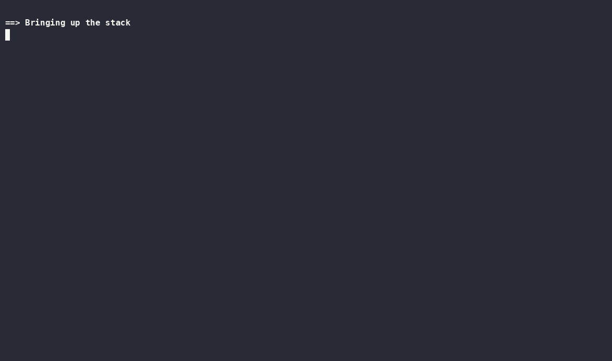
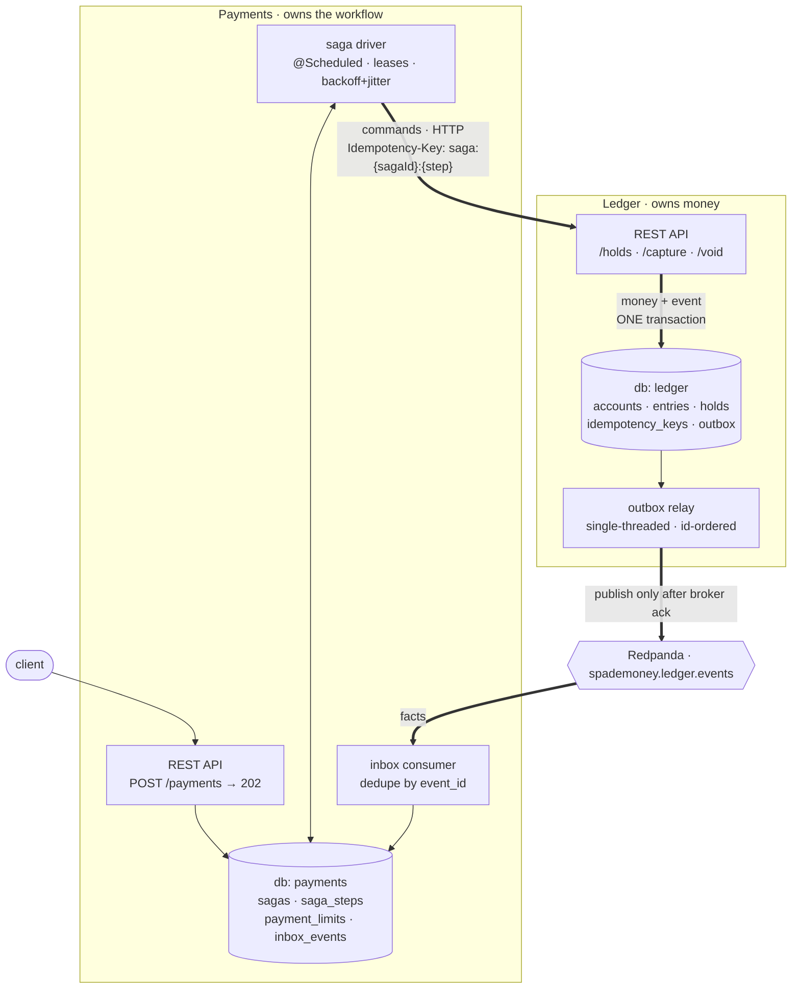
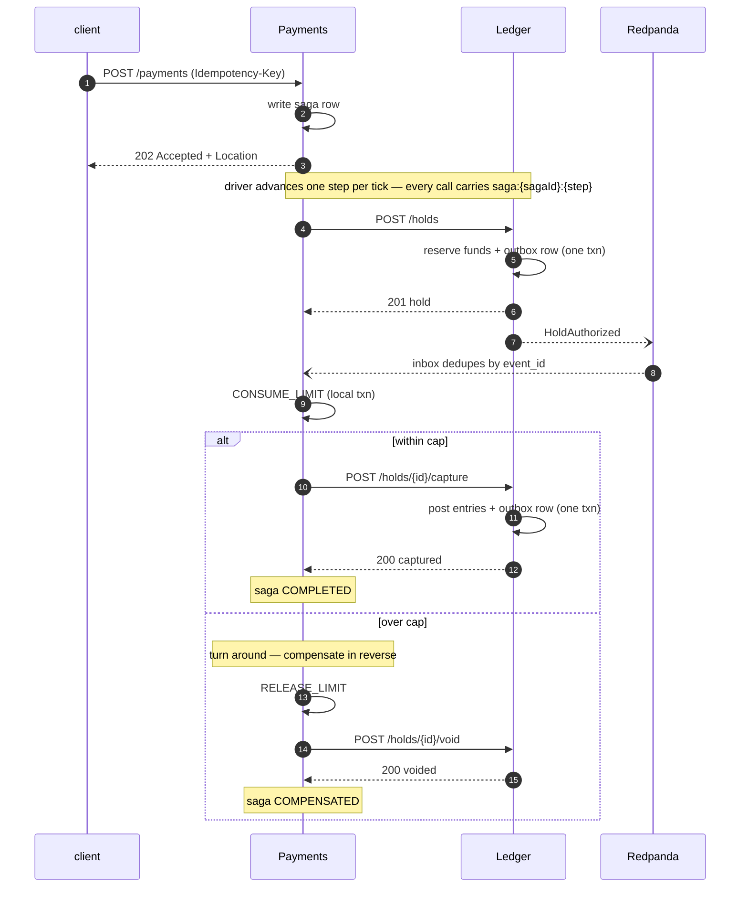

# SpadeMoney

A double-entry payments ledger split across two services, with the distributed
consistency problem solved rather than avoided.

Money is integer minor units in an append-only `entries` table; balances are
derived, never stored. Authorization holds, capture, void and refunds-as-reversals
sit on top of a four-case idempotency contract. The two services own separate
PostgreSQL **databases**, so no transaction can span them — payments are driven
by an orchestrated saga with compensating transactions, a transactional outbox,
and an idempotent consumer.

Kill the ledger mid-payment and it recovers with no manual intervention. Two
independent reconciliation jobs re-derive the invariants and tell you whether it
actually did.



That clip is `./chaos/demo.sh`. It sends one payment, `docker kill`s the Ledger
while the saga is in flight, restarts it, and shows the payment finish with no
manual intervention — then both services reconcile clean. Nothing in it is
staged; it is the same script anyone can run.

---

## What this is

| | |
|---|---|
| **Java 25, Spring Boot 4** | virtual threads, Jackson 3, `JdbcClient` with hand-written SQL |
| **PostgreSQL 16** | two databases, one per service — no cross-database transaction is possible |
| **Redpanda** | Kafka-compatible; the outbox relay's transport |
| **204 tests** | Testcontainers against real Postgres and a real broker |

Two services, exactly:

- **Ledger** — owns money. Accounts, immutable entries, authorization holds,
  capture, void, refunds-as-reversals, and the four-case idempotency contract.
- **Payments** — owns the workflow. Accepts a payment, drives a three-step saga
  across the boundary, compensates when a step fails.

---

## Architecture



**Read the two heavy paths in opposite directions.** Commands go out over HTTP
(Payments → Ledger); facts come back over Kafka (Ledger → Payments). The
asymmetry is deliberate: a command can be refused and the caller needs the
refusal synchronously, whereas a fact has already happened, nobody may refuse
it, and it only has to arrive *eventually* — exactly once in effect.

Three things in that picture carry the whole design:

1. **Two databases, not two schemas.** `db: ledger` and `db: payments` are
   separate PostgreSQL databases in one instance. Postgres has no
   cross-database transaction, so "just wrap both writes in one transaction" is
   not discouraged here — it is *unavailable*. The seam is enforced by the
   engine rather than by discipline
   ([ADR-0016](docs/adr/0016-two-databases-one-instance.md)).
2. **The money and the event commit together.** That is the `ONE transaction`
   arrow. `OutboxWriter` is deliberately *not* `@Transactional`; it runs inside
   the caller's existing transaction, and that absence is the mechanism
   ([ADR-0019](docs/adr/0019-outbox-written-in-the-domain-transaction.md)).
3. **The relay publishes before it marks.** At-least-once, never at-most-once —
   marking first would trade a visible duplicate for a silent loss. The inbox
   consumer absorbs the duplicates by claiming `event_id` and applying the
   effect in one local transaction, which is what turns at-least-once delivery
   into exactly-once *effects*
   ([ADR-0020](docs/adr/0020-exactly-once-effects-not-delivery.md)).

### A payment, end to end



`CONSUME_LIMIT` is the only step whose effect commits in *Payments'* database,
and it sits between two remote effects it cannot be atomic with. When it
refuses, the hold is already real — which is the exact moment a compensating
transaction becomes the only option available. That is why the saga exists, and
why the middle step is where it is.

The event stream is not decoration on top of the HTTP calls. Every other fact
the saga needs arrives on a reply to a command it issued; a **hold expiring** is
the one fact that originates on the Ledger side with nobody having asked for it,
and no reply would ever mention it.

### The full API surface

| Ledger (`:8080`) | | Payments (`:8081`) | |
|---|---|---|---|
| `POST /transfers` | direct transfer | `POST /payments` | start a payment → `202` |
| `GET /transfers/{id}` | | `GET /payments/{id}` | saga state + per-step detail |
| `POST /holds` | authorize | `PUT /limits/{accountId}` | set a spending cap |
| `POST /holds/{id}/capture` | full or partial | `GET /limits/{accountId}` | |
| `POST /holds/{id}/void` | release | `GET /reconciliation` | 6 checks |
| `GET /holds/{id}` | | | |
| `POST /refunds` | reversing entries | | |
| `GET /accounts/{id}/balance` | posted / held / available | | |
| `GET /reconciliation` | 7 checks | | |

Payments calls only `POST /holds`, `/capture`, `/void` during a saga, plus
`GET /holds/{id}` and `GET /transfers/{id}` when reconciling. It never calls
`POST /transfers` — that endpoint exists for direct ledger use and is what the
M1 test suite exercises.

---

## Quickstart

Requires Docker, `curl`, and `python3`. Nothing else — not even `jq`.

```bash
git clone https://github.com/wuy55/spademoney && cd spademoney
docker compose up -d          # builds both services, migrates, seeds demo accounts
```

Wait for all four services to report healthy (`docker compose ps`), then pay:

```bash
curl -i -X POST localhost:8081/payments \
  -H 'Content-Type: application/json' \
  -H 'Idempotency-Key: my-first-payment' \
  -d '{"payerAccountId":2,"payeeAccountId":3,"amountMinor":2500,"currency":"USD"}'
```

You get `202 Accepted` and a `Location`. The payment is a saga that has been
written down, not one that has finished — follow it:

```bash
curl -s localhost:8081/payments/<paymentId> | python3 -m json.tool
curl -s localhost:8080/accounts/2/balance   | python3 -m json.tool
```

And ask both services whether the books are right:

```bash
curl -s localhost:8080/reconciliation | python3 -m json.tool
curl -s localhost:8081/reconciliation | python3 -m json.tool
```

### See the compensation path

Drop the payer's spending cap below the payment amount, then pay. The saga takes
the hold, the local limit check refuses, and it unwinds — releasing the cap and
voiding the hold in the Ledger:

```bash
curl -X PUT localhost:8081/limits/2 -H 'Content-Type: application/json' \
     -d '{"capMinor":1000,"currency":"USD"}'
```

---

## Proving it

Every number below comes from a committed script. None was typed by hand.

```bash
./chaos/smoke-test.sh     # happy path, end to end, over the real stack
./chaos/chaos-test.sh     # SIGKILL the ledger mid-saga; assert nothing was lost
./chaos/demo.sh           # the narrated one-payment version (the clip above)
./load/run.sh             # k6 load test; regenerates load/report.md
```

**Chaos** ([`chaos/`](chaos/)) — `docker kill`, not `stop`: SIGKILL, no graceful
shutdown. Payments are fired concurrently first so the kill lands across all
three saga steps at once, and the script verifies it actually landed mid-saga
rather than quietly asserting something weaker.

| Run | at the kill | outcome | ledger net |
|---|---|---|---|
| 8s outage | 12 in flight, 11 holds, 2 captured | 12 completed | **0** |
| 75s outage | 10 in flight, 11 holds, 2 captured | 8 completed, 4 compensated | **0** |

The 75-second run is the more interesting one: four payments outlived the retry
budget, were declined, and had their holds voided and caps released once the
Ledger returned.

What the chaos test asserts — read from the `entries` table directly, *then*
cross-checked against both services' reconciliation as a second opinion, because
a check that asks the system whether the system is correct is not a check:

- payee credited exactly `amount × completed`, payer debited the same
- the ledger nets to zero
- **exactly one `CAPTURE` per completed payment** — the line that would fail if a
  retry had ever become a second charge
- no hold left reserving funds, no spending cap left held

**Load** ([`load/report.md`](load/report.md)) — the accept path is not the
constraint; it is a single insert, and it stayed flat from 50 to 200 req/s with
a sub-10ms p99 and no errors. The saga driver's configured throughput is the real
ceiling, and the report says so rather than quoting the flattering number alone.

---

## Design documents

- **[DESIGN.md](DESIGN.md)** — the whole argument: what the invariants are, where
  the distributed problem actually is, and how each mechanism earns its place.
- **[docs/adr/](docs/adr/)** — 26 architecture decision records, including the
  decisions *not* taken and what they cost.
- **[RUNBOOK.md](RUNBOOK.md)** — operating it: health, stuck sagas, the
  dead-letter topic, what to do when reconciliation reports something.
- **[docs/openapi.yaml](docs/openapi.yaml)** — hand-written, kept honest by HTTP
  contract tests rather than generated from annotations.

---

## Known limitations

Stated here rather than discovered by a reader:

- **Both databases live in one Postgres container.** They share a failure domain,
  which a real deployment would not. It does not weaken the chaos test, which
  kills *application* containers.
- **A capture has no compensation.** Undoing one means posting a refund, which is
  a business decision with its own authorization — not something a retry loop
  should issue on its own.
- **The spending cap is a lifetime total, not a rolling window.** One `WHERE`
  predicate away; the interesting property is the check-and-record atomicity, not
  the calendar.
- **Cross-service reconciliation samples recent sagas** rather than all history.
  An unbounded diagnostic is an outage waiting for a busy day.
- **`/limits` has no authentication.** It is an operator surface, and a token
  nobody checks would be worse than saying so.
- **One saga driver instance.** The lease-based claim makes more of them safe,
  but that is untested and therefore unclaimed.

## License

MIT — see [LICENSE](LICENSE).
